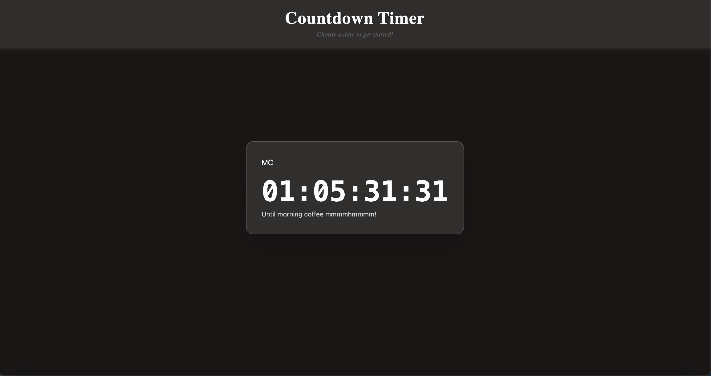

# Countdown Timer

This is a simple countdown timer application that takes in an inputted date/time    
and displays a countdown with React useState from now until the given date/time.  

## Current Features

- Currently uses a hardcoded target date for a _very important_ event :) 
- Displays the countdown for the target date on a nice looking box with a title and description

## Technologies Used

- Typescript and React
- Vite
- Tailwindcss

## Future Updates

- User input for a target date + optional title and description
- Customization of the timer:
  - BG Color (gradient or solid)
  - Font for title/desc
  - Font for timer (different than title/desc)
  - Other simple css : i.e box shadow
- JSON Export and Import to locally save a timer
- Finalize app styles
- User input menu component
- Style changer menu component
- Mobile support
- Tests for making sure the times are correct (who knows at this point)
- Host with Netlify? Platform not finalized 
- Animation or sound on timer finish

## Try it out before launch!
- `git clone` the repository
- `cd` into the newly cloned repo
- run `npm install` in your terminal
- run `npm run dev` in your terminal 
- Navigate to `localhost:5173` in your browser

